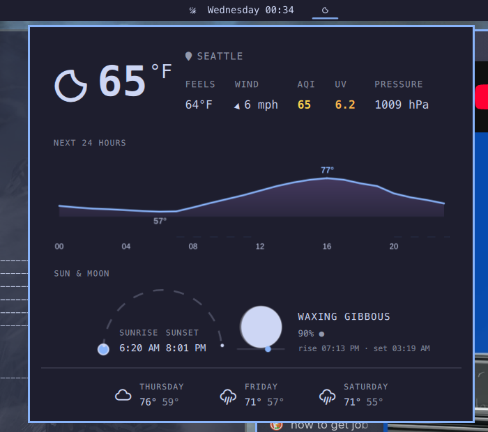

# omarchy-weather-widget

Omarchy shell plugin: weather pill with detail popup — current conditions, hourly, forecast, AQI, sun/moon.

A custom bar widget for the [Omarchy](https://omarchy.org/) shell, cloned from the stock `omarchy.weather` plugin and extended:

- Current conditions pill in the bar (icon, temperature, unit) with a detail popup
- Hero row: condition icon, big temperature, location, feels-like / wind / AQI / UV / pressure
- Next-24-hours temperature chart (Open-Meteo)
- Sun arc with live sun position between sunrise and sunset
- Moon phase disc (canvas-drawn terminator) with a horizon track showing the moon's sky position between moonrise and moonset
- 3-day forecast
- Click-to-edit location with geocode suggestions (`wttr.in` + Open-Meteo geocoding)

## Install

Copy or clone this plugin into `~/.config/omarchy/plugins/`:

```bash
git clone https://github.com/abhinavshashank/omarchy-weather-widget ~/.config/omarchy/plugins/main.weather
```

Then add `main.weather` to the bar layout in `~/.config/omarchy/shell.json` (or via `omarchy bar`).

Optional helper for desktop notifications:

```bash
cp bin/omarchy-notification-weather ~/.local/bin/
```

## Screenshot



## Files

- `manifest.json` — plugin metadata (`main.weather`, bar-widget entry point)
- `BarWidget.qml` — bar pill, click handling, panel injection
- `Panel.qml` — detail popup: hero, hourly chart, sun/moon viz, forecast, location editor
- `Model.js` — wttr.in / Open-Meteo parsing and helpers
